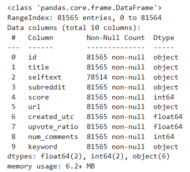
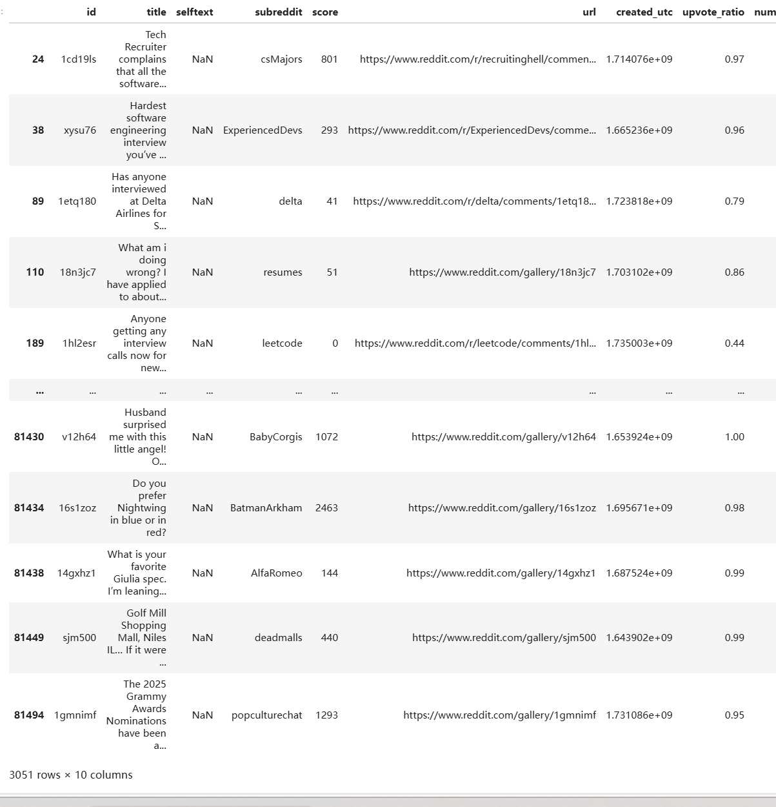

# Reddit Tech Job-Related Post Recommendation System

This project presents an intelligent Reddit crawler and recommender system tailored for job seekers in the tech industry. Unlike Reddit’s native keyword search—which is limited, noisy, and poorly suited for complex queries—our system surfaces the most relevant job-related posts based on a rich, curated set of user-defined interests.

## Motivation

Reddit hosts a wealth of career-related discussions and job opportunities. However, its default search mechanism suffers from several limitations:

* Exact keyword match only, without semantic understanding
* Noisy results, often showing outdated or irrelevant content
* Prioritization based on upvotes, not relevance
* Inability to handle complex queries with multiple terms
* Limited scope to a single subreddit at a time

This system was built to overcome those challenges and offer job seekers a structured, customizable, and accurate way to explore Reddit for career opportunities.

Here is the refined `## Data` section with improved flow, clarity, and formatting—ready to be used in your `README.md`:

---

## Data

To evaluate the effectiveness of our Reddit Job Post Recommendation System, we built a **balanced dataset** that includes both job-related and non-job-related posts. This allows us to test the system's ability to distinguish between:

* **Highly relevant** (e.g., actual job listings, interview tips)
* **Weakly relevant** (e.g., discussions tangential to jobs)
* **Irrelevant** (e.g., university admissions or general academic posts)

### Dataset Composition

* **\~500 job-related keywords** curated using GPT, covering a wide spectrum of roles and technologies
* **\~100 noise keywords** related to academic programs and admissions (e.g., “nyu admission”, “stanford course”) to simulate realistic distractions
* **Mixed subreddit sources** to ensure diversity in post origin (e.g., r/cscareerquestions, r/jobs, r/learnprogramming)
* **Random noise** injected during crawling to simulate the natural variability in Reddit posts

> Note: If you obtain a slightly different number of posts when running the crawler, it's likely due to new posts being created on Reddit that match the given keywords.

### Resources

* [Data Overview (Google Drive)](https://drive.google.com/file/d/19-L9uokhJ72hHRwOqGjXF28cygm3ZcYa/view)
* 
* 

## Key Features

Our system improves on Reddit's native search by:

* Reading from a customizable list of job-related keywords (`keywords.txt`)
* Scanning multiple subreddits in parallel
* Extracting posts where all keywords are present anywhere in the post (non-adjacent matching)
* Filtering duplicates and irrelevant matches
* Outputting structured results with post title, upvotes, and a direct link for easy navigation

## Comparison with Reddit Native Search

| Feature                       | Reddit Native Search | This System                               |
| ----------------------------- | -------------------- | ----------------------------------------- |
| Fuzzy or Partial Match        | No                   | Yes (all keyword terms present, anywhere) |
| Multi-Subreddit Search        | No                   | Yes                                       |
| Structured Output             | No                   | Yes (CSV or DataFrame format)             |
| Long Complex Queries          | Poor support         | Fully supported                           |
| Redundancy Elimination        | No                   | Yes                                       |
| Handles Noise/False Positives | No                   | Yes                                       |

### Example Comparison (Screenshots)

**Reddit Native Search Result for**: `deep learning career`


**Our System Output for the Same Query**


The difference is clear—our system returns clean, concise, and on-topic results.

## Project Structure

```
├── crawler.py              # Core Reddit crawler using PRAW and keyword matching
├── keywords.txt            # List of job-related and control keywords
├── recommend.ipynb         # Notebook for post-processing, filtering, and visualization
├── screenshots/            # Folder for visual comparisons
├── data/                   # (optional) directory for saving crawled results
```

## How to Run

### 1. Clone the Repository

```bash
git clone https://github.com/YOUR_USERNAME/Reddit-recommendation-system.git
cd Reddit-recommendation-system
```

### 2. Set Up the Python Environment

```bash
python3 -m venv venv
source venv/bin/activate
pip install -r requirements.txt
```

If `requirements.txt` is missing, install manually:

```bash
pip install praw pandas
```

### 3. Configure Reddit API Credentials

Edit `crawler.py` and replace the credentials:

```python
reddit = praw.Reddit(
    client_id="YOUR_CLIENT_ID",
    client_secret="YOUR_CLIENT_SECRET",
    user_agent="reddit-job-search"
)
```

Create your Reddit API credentials here: [https://www.reddit.com/prefs/apps](https://www.reddit.com/prefs/apps)

### 4. Run the Crawler

```bash
python crawler.py
```

The script will parse subreddits and save all matching posts to a file or display them in the terminal.

### 5. Explore and Refine Recommendations

Launch the Jupyter notebook for deeper filtering and analysis:

```bash
jupyter notebook recommend.ipynb
```

Use the notebook to:

* Filter by specific keywords or topics
* Visualize distribution of keywords
* Rank posts based on score or recency

## Real-Time Updates

The system supports saving and updating outputs via `.pkl` files, allowing you to maintain a real-time updated dataset that supports:

* Incremental additions
* Post deduplication
* History-aware filtering

## Future Work

* Integrate transformer-based sentence embeddings for semantic search
* Introduce date filtering (e.g., posts from the last 7 days)
* Build a lightweight web dashboard to visualize and interact with results
* Enable Reddit comment analysis for deeper context scoring

